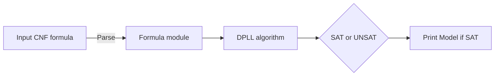

# SAT Solver 🧩

[](https://ocaml.org/)  [](https://opensource.org/licenses/MIT)  [](https://dune.build/)  

### A DPLL-based SAT solver built from scratch in OCaml!

## Features :

- Solves Boolean satisfiability problems (SAT) using the DPLL (Davis–Putnam–Logemann–Loveland) algorithm.

- Supports:
    - Unit propagation
    - Pure literal elimination
    - Backtracking search

- Random CNF formula generator to test and benchmark.

- Interactive REPL mode to input custom parameters for the random formula generator.

## Architecture :

- Formula.ml: Defines types for variables, literals, clauses, CNF formulas, and utility functions.

- Dpll.ml: Core DPLL logic for solving CNF formulas.

- Main.ml:

    - Provides two modes:

        - Solve a randomly generated CNF formula.

        - REPL mode to interactively input parameters for formula generation.



## Build :

```sh
cd sat_solver
dune build
```

## Run :

- for deafult mode :

```sh
dune exec ./_build/default/bin/main.exe
```
- to give custom parameter input :

```sh
dune exec ./_build/default/bin/main.exe repl
```


## Example REPL input:

```sh
Enter num_syms, num_clauses, num_literals (or 'exit' to quit): 5 4 3
```

- This generates a formula with:
    - 5 symbols.
    - 4 clauses.
    - 3 literals per clause.

## Testing :

- The core modules (Formula.ml, Dpll.ml) are designed with simplicity for correctness verification.
- Randomized tests possible through the REPL and generator.

## References :

- Public Opensoruce implementations of the DPLL algorithm.
- Theory: DPLL Algorithm for SAT Solving.
- code inspired by academic projects and OCaml style guides.

## License :

- MIT

---
##### “SAT solving is to complexity theory what prime numbers are to number theory.”
---